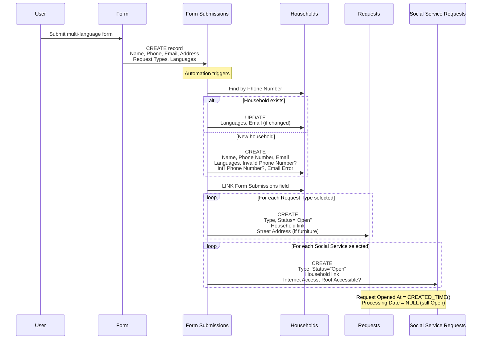
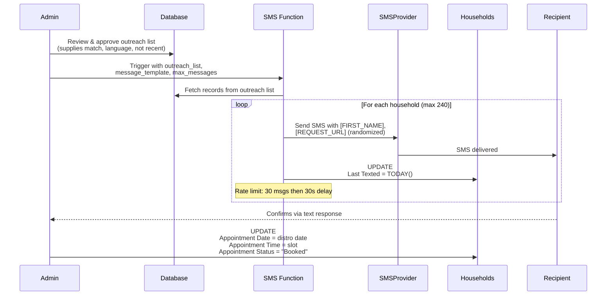
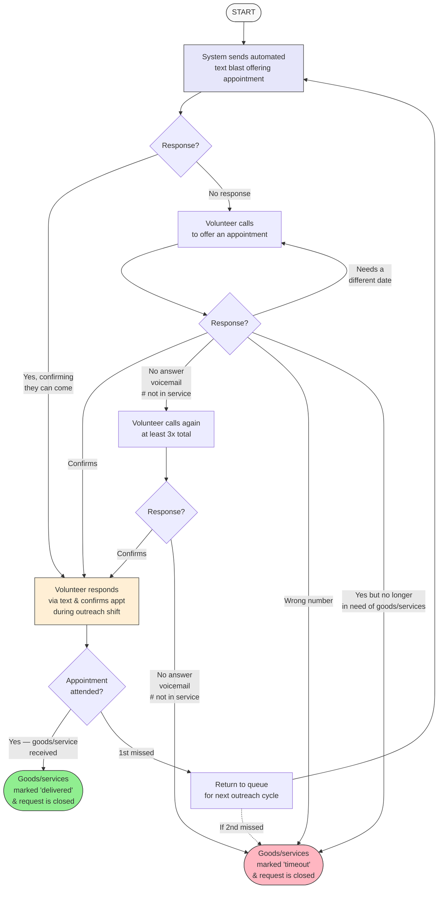
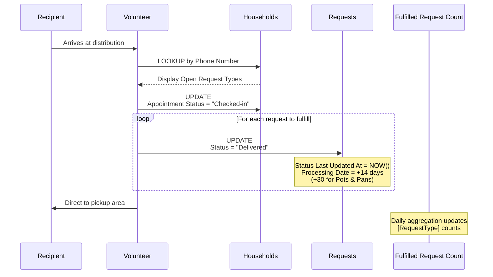
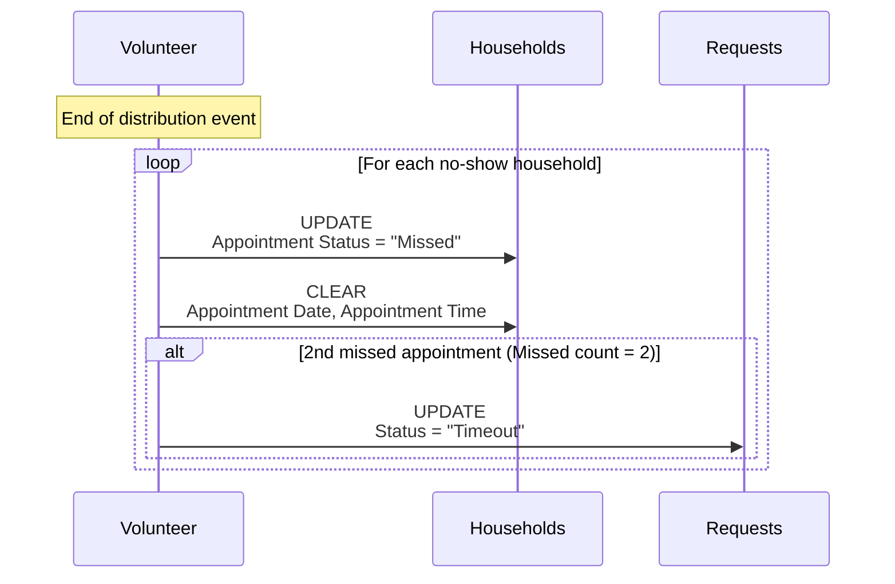

# BAM Mutual Aid System V2 - Technical Specification

## 1. Background

### Problem Statement
The current BAM mutual aid system has technical debt, relies on manual intervention for key workflows, and needs better data privacy practices. This specification defines the improved V2 system that addresses these issues while maintaining all existing functionality.

### Reference Documents
- **Current System Documentation:** [background-current-system.md](./background-current-system.md)
- **Existing Outreach Flowchart:** [bam-outreach-flowchart.png](./bam-outreach-flowchart.png)

### Stakeholders
- **Recipients**: Community members requesting goods/services
- **Volunteers**: Outreach, check-in, delivery/transport, furniture teams
- **Admins**: System administrators managing distributions and data
- **External Systems**: SMS provider, Database, Automation platform

---

## 2. Motivation

### Goals & Success Stories

**Recipient Journey:**
1. Submit request form (multi-language)
2. Receive text confirmation
3. Confirm appointment
4. Attend distribution event
5. Check in via phone number/name
6. Receive requested items
7. Re-request if needed

**Volunteer Goals:**
- Efficiently manage distribution outreach (text/phone)
- Check in recipients at events
- Track inventory post-distribution
- Coordinate furniture/delivery logistics

**System Goals:**
- Deduplicate requests automatically
- Maintain data privacy (hash sensitive data)
- Auto-expire stale requests (14 days standard, 30 days pots/pans)
- Track fulfilled vs outstanding requests
- Support 60 appointments per distribution (25% confirmation rate)

---

## 3. Scope and Approaches

### Non-Goals

| Technical Functionality | Reasoning | Tradeoffs |
|------------------------|-----------|-----------|
| Full automation of volunteer matching | Complex language/availability matching | Manual oversight still needed |
| Real-time inventory management | Informal post-distro reporting works | May miss accuracy |
| Automated language detection | Recipient knows best | Self-selection more reliable |

### Value Proposition

| Technical Functionality | Value | Tradeoffs |
|------------------------|-------|-----------|
| Request auto-expiration | Keeps queue fresh and relevant | May lose valid long-term requests |
| Timeout after 2nd missed appointment | Keeps queue accurate, reduces stale bookings | Recipient loses slot after two no-shows |

### Alternative Approaches

| Approach | Pros | Cons |
|----------|------|------|
| Full automation | Reduced manual work | Complex edge cases, less flexibility |
| Separate systems per workflow | Isolation, simpler components | Data silos, integration overhead |

### Relevant Metrics
- Fulfilled requests per type/volume
- Outstanding requests count
- Distribution attendance rate (~25% of outreach)
- Average 60 appointments per distribution
- 3 appointment-based distributions per week

---

## 4. Data Schema

### Tables Overview

#### Households
Primary table for recipient households.

| Field | Type | Description |
|-------|------|-------------|
| Name | singleLineText | Household name |
| ID | autoNumber | Unique identifier |
| Phone Number | phoneNumber | Primary contact (unique key) |
| Invalid Phone Number? | checkbox | Validation flag |
| Int'l Phone Number? | checkbox | International number flag |
| Email | email | Contact email |
| Email Error | singleLineText | Validation error message |
| Languages | multipleSelects | Preferred languages |
| Notes | richText | Free-form notes |
| Requests | multipleRecordLinks | Link to Requests table |
| Open Request Types | multipleLookupValues | Lookup of open request types |
| Delivered Request Types | multipleLookupValues | Lookup of delivered types |
| Social Service Requests | multipleRecordLinks | Link to Social Service Requests |
| Open Social Service Request Types | multipleLookupValues | Lookup of open SS types |
| Created At | createdTime | Record creation time |
| Updated At | lastModifiedTime | Last modification time |
| Date of Oldest Fulfillable Request | rollup | Earliest open request date |
| Legacy First/Last Date Submitted | date | Migration fields |
| Form Submissions | multipleRecordLinks | Link to form submissions |
| Appointment Date | date | Scheduled appointment |
| Appointment Time | singleSelect | Time slot (11:00 AM, 11:30 AM) |
| Appointment Status | singleSelect | Booked/Checked-in/Missed |
| Last Texted | date | Last SMS outreach date |

#### Requests
Individual goods/service requests linked to households.

| Field | Type | Description |
|-------|------|-------------|
| Label | formula | Display label (from Type) |
| Type | singleSelect | Request type (trilingual) |
| Household | multipleRecordLinks | Link to Households |
| Status | singleSelect | Open/Timeout/Delivered |
| Notes | multilineText | Request-specific notes |
| Updated At | lastModifiedTime | Last modification |
| Status Last Updated At | lastModifiedTime | When status changed |
| Legacy Date Submitted | date | Migration field |
| Request Opened At | formula | Effective open date |
| Processing Date | formula | Auto-calculated expiry (14/30 days) |
| Street Address | singleLineText | Delivery address |
| City, State | singleLineText | Location |
| Zip Code | number | Postal code |
| Geocode | singleLineText | Geo coordinates |
| Address | singleLineText | Formatted address |
| Phone Number (from Household) | multipleLookupValues | Lookup |
| Last texted (from Household) | multipleLookupValues | Lookup |

**Processing Date Formula:**
- Status changed to Delivered: +14 days (or +30 for Pots & Pans)
- Status changed to Timeout: +14 days

#### Social Service Requests
Separate table for social services (different from goods).

| Field | Type | Description |
|-------|------|-------------|
| Label | formula | Display label |
| Phone Number (from Household) | multipleLookupValues | Contact lookup |
| Type | singleSelect | Service type (12 options) |
| Status | singleSelect | Open/Timeout/Delivered |
| Household | multipleRecordLinks | Link to Households |
| Internet Access | multipleSelects | Current internet situation |
| Roof Accessible? | checkbox | For internet installation |
| Address fields | various | Location data |
| Status Last Updated At | lastModifiedTime | Status change time |
| Notes | multilineText | Service notes |
| Request Opened At | formula | Effective open date |
| Processing Date | formula | +14 days after status change |

#### Distros
Distribution event tracking.

| Field | Type | Description |
|-------|------|-------------|
| Date & Time | dateTime | Event date/time |
| Location | singleLineText | Venue |
| Duration | duration | Event length |
| Appointments | singleLineText | Appointment count/details |
| Notes | multilineText | Event notes |

#### Fulfilled Request Count
Aggregated metrics per date.

| Field | Type | Description |
|-------|------|-------------|
| Date | date | Reporting date |
| [Request Type] | number | Count per type (50+ columns) |

#### Assistance Request Form Submissions
Raw form intake data.

| Field | Type | Description |
|-------|------|-------------|
| ID | autoNumber | Submission ID |
| Name | singleLineText | Requestor name |
| Address fields | various | Location data |
| Phone Number | phoneNumber | Contact |
| Email | email | Contact |
| Languages | multipleSelects | Preferred languages |
| Request Types | multipleSelects | Goods requested |
| Furniture Items | multipleSelects | Furniture specifics |
| Bed Details | multipleSelects | Bed size/type |
| Furniture Acknowledgement | checkbox | Terms accepted |
| Kitchen Items | multipleSelects | Kitchen specifics |
| Social Service Requests | multipleSelects | Services needed |
| Internet Access | multipleSelects | Current situation |
| Roof Accessible? | checkbox | For internet |
| Notes | richText | Additional info |
| Created At | createdTime | Submission time |
| Households | multipleRecordLinks | Link to created household |

### Status Values

**Request Status:**
- **Open**: Active, awaiting fulfillment
- **Timeout**: Expired or no response
- **Delivered**: Fulfilled

**Appointment Status:**
- **Booked**: Confirmed for distribution
- **Checked-in**: Attended, checking in
- **Missed**: No-show

---

## 5. System Functions

### Scheduled Jobs (Cron)

| Function | Schedule | Purpose |
|----------|----------|---------|
| `UpdateWebsiteRequestData` | Hourly | Publishes open request counts to website JSON |

### Web-Triggered Functions

| Function | Purpose |
|----------|---------|
| `send_sms` | Sends SMS text blasts |

---

## 6. Step-by-Step Flows

### 6.1 Intake Processing (Happy Path)

**Pre-condition:** Form submission received in Intake Table

1. **User** submits multi-language conditional intake form
2. **System** validates and stores all fields in Intake Table
3. **System** applies filters and creates Household row
4. **System** creates Request rows per request type
5. **System** normalizes data
6. **System** deletes Intake Table row
7. **System** schedules auto-expiration (14/30 days)

**Post-condition:** Household and Request records exist; Intake cleared

#### Sequence Diagram

---

### 6.2 Distribution Outreach Flow (Happy Path)

**Pre-condition:** Distribution scheduled, inventory checked

1. **Admin** reviews and approves the outreach list for this distro, filtering by:
   - Available supplies match
   - Language availability at distro
   - Not recently attended
2. **System** sends text blast to the outreach list with language-specific templates
3. **Recipients** respond to confirm (target: 240 people for 60 appointments)
4. **Volunteer** manually marks confirmations
5. **Recipients** attend distribution

**Post-condition:** Appointments confirmed, ready for check-in

#### Sequence Diagram

#### Outreach Flowchart

---

### 6.3 Check-In Flow (Happy Path)

**Pre-condition:** Recipient confirmed appointment

1. **Recipient** arrives at distribution
2. **Volunteer** performs phone number lookup
3. **System** displays recipient's requests
4. **Volunteer** marks requests as fulfilled
5. **Volunteer** directs recipient to pickup area

**Post-condition:** Request closed

#### Sequence Diagram

#### No-Show Sequence

---

### 6.4 Alternate / Error Paths

| # | Condition | System Action | Suggested Handling |
|---|-----------|---------------|-------------------|
| A1 | Partial fulfillment (out of stock) | Keep request open | Do not mark as fulfilled to prevent deprioritization |
| A2 | 1st missed appointment | Mark as missed | Return to queue for next outreach cycle |
| A3 | 2nd missed appointment | Mark as timeout | Close request |
| A4 | No response after phone call attempts | Mark as timeout | Close request |
| A5 | Wrong number | Mark as invalid | Close request |
| A6 | No longer needs goods | Mark complete | Close request |

---

## 7. Edge Cases and Concessions

### Data
- **Edge case**: Multiple households sharing same phone number
- **Edge case**: Multiple phone numbers per household - may create duplicate households

### Request Expiration
- **Concession**: 14-day window may be too short for some needs
- **Exception**: Pots/pans get 30-day window due to availability constraints

### Outreach
- **Concession**: Outreach list is manually curated by admin — automated list generation is post-MVP
- **Edge case**: Language matching between volunteers and recipients is manual

### Fulfillment
- **Design decision**: Partial fulfillment keeps request open to prevent deprioritization
- **Concession**: Post-distro inventory is informal text-based reporting

---

## 8. Open Questions

1. **Volunteer Access**: What is the access revocation timeline and process?
2. **Furniture Team Flow**: Need detailed workflow from furniture team (currently not taking new requests)
3. **Phone Call Outreach**: Need to research and document single-person phone outreach flow
4. **Admin Flows**: Need to interview admins to document administrative workflows
5. **Cron Jobs**: Review automation jobs for technical debt assessment

---

## 9. Glossary / References

### Terms
- **BAM** - Bushwick Ayuda Mutua
- **Distro** - Distribution event where recipients pick up goods
- **Intake** - Initial request submission from community members
- **Text Blast** - Automated SMS outreach to target population
- **Timeout** - Request closed due to no response after all contact attempts

### Request Types
- Diapers (sizes 1-6)
- Pads/Tampons/Panty liners
- Soap
- School supplies
- Masks/COVID tests
- Kitchen supplies
- Furniture (separate flow)
- Pots and pans (30-day expiry)

### Links
- **Current System Background:** [background-current-system.md](./background-current-system.md)
- **Appendix (Post-MVP Flows & Feature Suggestions):** [appendix.md](./appendix.md)

